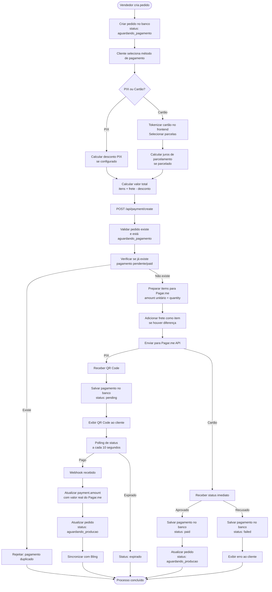

# Documentação Completa do Fluxo de Pagamentos

## Índice

1. [Visão Geral](#visão-geral)
2. [Estrutura de Dados](#estrutura-de-dados)
3. [Fluxo Completo de Pagamento](#fluxo-completo-de-pagamento)
4. [Cenários Detalhados](#cenários-detalhados)
5. [Regras de Negócio](#regras-de-negócio)
6. [Integração com Pagar.me](#integração-com-pagarme)
7. [Problemas e Melhorias Identificadas](#problemas-e-melhorias-identificadas)

---

## Visão Geral

O sistema de pagamentos é responsável por processar pagamentos de pedidos através da integração com o Pagar.me. Suporta dois métodos principais: **PIX** e **Cartão de Crédito**, com suporte a parcelamento e descontos configuráveis.

### Componentes Principais

- **Frontend**: `components/checkout/PaymentForm.tsx` - Interface do checkout
- **Backend API**: `app/api/payment/create/route.ts` - Criação de pagamentos
- **Webhook**: `app/api/payment/webhook/route.ts` - Confirmação de pagamentos
- **Integração Pagar.me**: `lib/pagarme.ts` - Funções de comunicação com API
- **Regras de Pagamento**: `lib/payment-rules.ts` - Cálculo de descontos e juros
- **Regras de Frete**: `lib/shipping-rules.ts` - Aplicação de regras de frete

---

## Estrutura de Dados

### Tabela `orders`

Armazena os pedidos do sistema. Campos relevantes para pagamento:

- `id`: ID único do pedido
- `status`: Status atual (`aguardando_pagamento`, `aguardando_producao`, etc.)
- `total_items`: Soma dos valores dos produtos (sem frete)
- `total_shipping`: Valor do frete selecionado pelo vendedor
- `total`: Valor total do pedido (`total_items + total_shipping`)
- `paid_at`: Timestamp de quando o pedido foi pago
- `payment_link_token`: Token do link de pagamento (se gerado)
- `payment_link_expires_at`: Data de expiração do link

**Importante**: O `total_shipping` vem diretamente da escolha do vendedor e **não é recalculado** com regras de frete grátis na criação do pagamento.

### Tabela `payments`

Registra todos os pagamentos realizados. Um pedido pode ter múltiplos pagamentos.

- `id`: ID único do pagamento
- `order_id`: ID do pedido (FK para `orders`)
- `pagarme_transaction_id`: ID da transação no Pagar.me
- `method`: Método de pagamento (`pix`, `credit_card`, `pix_manual`)
- `installments`: Quantidade de parcelas (1 = à vista)
- `amount`: Valor realmente cobrado (atualizado pelo webhook)
- `status`: Status do pagamento (`pending`, `paid`, `failed`)
- `paid_at`: Timestamp de confirmação do pagamento

**Importante**: O campo `amount` é inicialmente salvo com o valor calculado, mas é **atualizado pelo webhook** com o valor real cobrado pelo Pagar.me.

### Tabela `order_items`

Itens do pedido com seus valores e quantidades.

- `id`: ID único do item
- `order_id`: ID do pedido (FK)
- `product_id`: ID do produto (opcional)
- `title`: Nome do produto
- `price`: Preço unitário do produto
- `quantity`: Quantidade do item
- `observations`: Observações do item

---

## Fluxo Completo de Pagamento

### Diagrama de Fluxo Geral



---

## Cenários Detalhados

### Cenário 1: Pagamento PIX com Frete Pago

**Situação**: Pedido com produtos no valor de R$ 110,00 e frete de R$ 92,47, totalizando R$ 202,47.

**Fluxo**:

1. **Criação do Pedido** (`POST /api/orders`)
   - Vendedor cria pedido com `total_items = 110.00`, `total_shipping = 92.47`, `total = 202.47`
   - Status inicial: `aguardando_pagamento`
   - Itens salvos na tabela `order_items` com `price` e `quantity`

2. **Cliente Acessa Checkout**
   - Frontend busca dados do pedido via `GET /api/checkout/[orderId]`
   - Exibe valores: Total R$ 202,47 (R$ 110,00 produtos + R$ 92,47 frete)

3. **Cliente Seleciona PIX**
   - Frontend carrega configuração de desconto PIX (se houver)
   - Desconto aplicado apenas sobre `total_items` (R$ 110,00), não sobre frete
   - Exemplo: Se desconto de 5%, novo total = R$ 104,50 (produtos) + R$ 92,47 (frete) = R$ 196,97

4. **Criação do Pagamento** (`POST /api/payment/create`)
   - Backend busca pedido e valida status
   - Busca itens do pedido: `SELECT id, product_id, title, price, quantity FROM order_items`
   - Calcula `backendTotal = recalculateOrderTotal(orderItems, totalShipping)`
     - `totalItems = sum(price × quantity)` = R$ 110,00
     - `backendTotal = totalItems + totalShipping` = R$ 202,47
   - Aplica desconto PIX (se houver) apenas sobre `itemsTotal`
   - Calcula `amount` em centavos: `amount = (chargeBaseValue × 100)` = 20247 centavos

5. **Preparação dos Items para Pagar.me** (`lib/pagarme.ts`)
   - Para cada item do pedido:
     - `amount = price × 100` (valor unitário em centavos)
     - `quantity = quantity` (quantidade)
     - Exemplo: Item R$ 78,89, quantidade 2:
       - `amount = 7889` centavos (unitário)
       - `quantity = 2`
       - Pagar.me calcula: `7889 × 2 = 15778` centavos
   - Calcula soma dos items: `itemsTotal = sum(amount × quantity)`
   - Se `params.amount > itemsTotal`, adiciona frete como item:
     - `difference = 20247 - 11000 = 9247` centavos
     - Adiciona item: `{ amount: 9247, description: "Frete", quantity: 1 }`

6. **Envio para Pagar.me**
   - Request body contém:
     ```json
     {
       "items": [
         { "amount": 11000, "description": "Produto", "quantity": 1, "code": "item-1" },
         { "amount": 9247, "description": "Frete", "quantity": 1, "code": "shipping-55" }
       ],
       "payments": [{ "payment_method": "pix" }]
     }
     ```
   - Pagar.me soma os items: `11000 + 9247 = 20247` centavos = R$ 202,47

7. **Resposta do Pagar.me**
   - Retorna `transaction.id` (order ID)
   - Retorna QR Code PIX
   - Status inicial: `pending`

8. **Salvamento no Banco**
   - Insere em `payments`:
     - `amount = "202.47"` (valor calculado)
     - `status = "pending"`
     - `pagarme_transaction_id = transaction.id`

9. **Polling de Status** (Frontend)
   - A cada 10 segundos, chama `GET /api/payment/status?transaction_id=...`
   - Quando status muda para `paid`, para o polling

10. **Webhook do Pagar.me** (`POST /api/payment/webhook`)
    - Pagar.me envia notificação quando pagamento é confirmado
    - Extrai `charge_id` e `amount` realmente cobrado
    - Atualiza `payments.amount` com valor real
    - Atualiza `payments.status = "paid"`
    - Atualiza `orders.status = "aguardando_producao"`
    - Sincroniza com Bling

### Cenário 2: Pagamento Cartão Parcelado com Frete

**Situação**: Pedido de R$ 500,00 (produtos) + R$ 50,00 (frete) = R$ 550,00, parcelado em 4x.

**Fluxo**:

1. **Criação do Pedido**: Similar ao cenário 1

2. **Cliente Seleciona Cartão**
   - Frontend tokeniza dados do cartão usando Pagar.me JS
   - Cliente seleciona 4 parcelas
   - Frontend busca taxas de parcelamento via API pública

3. **Cálculo de Juros** (`lib/payment-rules.ts`)
   - Busca taxa para 4 parcelas no ambiente correto
   - Exemplo: Taxa de 9,08% para 4x
   - Calcula: `totalWithInterest = 550.00 × (1 + 9.08/100) = 599.94`
   - Valor da parcela: `599.94 / 4 = 149.99`

4. **Criação do Pagamento**
   - `amount = 59994` centavos (com juros)
   - Items preparados:
     - Produtos: `amount = 50000`, `quantity = 1`
     - Frete: `amount = 5000`, `quantity = 1`
   - Total items: `50000 + 5000 = 55000`
   - Diferença: `59994 - 55000 = 4994` centavos (juros)
   - **Problema identificado**: Juros não são adicionados como item separado, causando inconsistência

5. **Envio para Pagar.me**
   - Request body inclui `installments: 4`
   - Pagar.me processa e retorna status imediato

6. **Resposta Imediata**
   - Se aprovado: `status = "paid"`
   - Se recusado: `status = "failed"`
   - Backend atualiza pedido imediatamente se aprovado

### Cenário 3: Frete Grátis com Regra Ativa

**Situação**: Pedido de R$ 300,00 com CEP que se enquadra em regra de frete grátis, mas vendedor escolheu modalidade paga de R$ 40,00.

**Fluxo**:

1. **Criação do Pedido**
   - Vendedor seleciona modalidade de frete paga (R$ 40,00)
   - Pedido criado com `total_shipping = 40.00`
   - **Regra importante**: Mesmo que existam regras de frete grátis aplicáveis, o valor escolhido pelo vendedor é respeitado

2. **Criação do Pagamento**
   - Backend usa `order.total_shipping` diretamente
   - **Não recalcula** com regras de frete grátis
   - Valor cobrado: R$ 300,00 (produtos) + R$ 40,00 (frete) = R$ 340,00

3. **Items Enviados**
   - Produtos: `amount = 30000`, `quantity = 1`
   - Frete: `amount = 4000`, `quantity = 1`
   - Total: R$ 340,00

**Observação**: As regras de frete grátis são aplicadas apenas na **cotação de frete** (quando o vendedor está escolhendo a modalidade), não na cobrança do pagamento.

### Cenário 4: Múltiplos Items com Quantidades Diferentes

**Situação**: Pedido com 2 unidades de Item A (R$ 50,00) e 3 unidades de Item B (R$ 30,00), frete R$ 20,00.

**Cálculo**:
- Item A: `50.00 × 2 = 100.00`
- Item B: `30.00 × 3 = 90.00`
- Total produtos: `190.00`
- Total com frete: `210.00`

**Items Enviados ao Pagar.me**:
```json
{
  "items": [
    { "amount": 5000, "description": "Item A", "quantity": 2, "code": "item-1" },
    { "amount": 3000, "description": "Item B", "quantity": 3, "code": "item-2" },
    { "amount": 2000, "description": "Frete", "quantity": 1, "code": "shipping-49" }
  ]
}
```

Pagar.me calcula: `(5000 × 2) + (3000 × 3) + (2000 × 1) = 21000` centavos = R$ 210,00

---

## Regras de Negócio

### Regra 1: Valor do Frete

- O `total_shipping` vem **diretamente da escolha do vendedor** ao criar/editar o pedido
- **Não é recalculado** com regras de frete grátis na criação do pagamento
- Se o vendedor escolhe uma modalidade paga, o frete **sempre será cobrado**, mesmo que existam regras de frete grátis aplicáveis

### Regra 2: Desconto PIX

- Desconto PIX é aplicado **apenas sobre o valor dos produtos** (`total_items`)
- O frete **não recebe desconto**
- Cálculo: `valorFinal = (totalItems - desconto) + totalShipping`

### Regra 3: Juros de Parcelamento

- Juros são aplicados sobre o **valor total** (produtos + frete)
- Taxas são configuráveis por ambiente (sandbox/production)
- Parcelas podem ser marcadas como "sem juros" se:
  - A taxa está marcada como `interest_free = true`
  - E não há parcela mínima configurada OU valor da parcela >= parcela mínima

### Regra 4: Proteção contra Duplicação

- Sistema verifica se já existe pagamento `pending` ou `paid` antes de criar novo
- Se existir, retorna erro: "Já existe um pagamento em processamento ou aprovado"

### Regra 5: Valor Real vs Valor Calculado

- Valor inicial salvo em `payments.amount` é o **valor calculado** pelo sistema
- Valor é **atualizado pelo webhook** com o valor real cobrado pelo Pagar.me
- A página de pedidos exibe `payment_amount` que vem do banco (já atualizado pelo webhook)

### Regra 6: Items no Pagar.me

- `amount` deve ser **valor unitário** em centavos
- `quantity` é a quantidade
- Pagar.me multiplica automaticamente: `totalItem = amount × quantity`
- Frete é adicionado como item separado quando há diferença entre total e soma dos produtos

---

## Integração com Pagar.me

### Estrutura de Request Body

#### PIX

```json
{
  "items": [
    {
      "amount": 7889,
      "description": "Produto",
      "quantity": 2,
      "code": "prod-123"
    },
    {
      "amount": 9247,
      "description": "Frete",
      "quantity": 1,
      "code": "shipping-55"
    }
  ],
  "customer": {
    "name": "Cliente",
    "email": "cliente@email.com",
    "document": "12345678901",
    "type": "individual",
    "phones": {
      "mobile_phone": {
        "country_code": "55",
        "area_code": "11",
        "number": "987654321"
      }
    }
  },
  "payments": [
    {
      "payment_method": "pix",
      "pix": {
        "expires_in": 3600
      }
    }
  ],
  "metadata": {
    "order_id": "55"
  }
}
```

#### Cartão de Crédito

```json
{
  "items": [...],
  "customer": {...},
  "payments": [
    {
      "payment_method": "credit_card",
      "credit_card": {
        "installments": 4,
        "card_token": "card_abc123",
        "statement_descriptor": "PEDIDO"
      }
    }
  ],
  "metadata": {
    "order_id": "55"
  }
}
```

### Estrutura de Response

O Pagar.me retorna um objeto `order` com:

- `id`: Order ID (usado como `pagarme_transaction_id`)
- `status`: Status do pedido
- `charges[0].id`: Charge ID (ID da cobrança)
- `charges[0].amount`: Valor cobrado em centavos
- `charges[0].last_transaction.status`: Status da última transação
- `charges[0].last_transaction.pix_qr_code`: QR Code PIX (se PIX)

### Webhook

O webhook recebe eventos quando o status do pagamento muda:

- Evento `charge.paid`: Pagamento confirmado
- Evento `charge.refused`: Pagamento recusado
- Evento `charge.pending`: Pagamento pendente

O webhook atualiza:
- `payments.status`
- `payments.amount` (com valor real)
- `payments.paid_at`
- `orders.status` (se pago)
- `orders.paid_at`

---

## Problemas e Melhorias Identificadas

### Problemas Críticos Encontrados

#### 1. Juros de Parcelamento Não Aparecem como Item Separado

**Problema**: Quando há parcelamento com juros, o valor total aumenta, mas os juros não são adicionados como item separado no Pagar.me. Isso pode causar inconsistência entre o valor calculado e o valor cobrado.

**Localização**: `app/api/payment/create/route.ts` linha 291-307

**Impacto**: Médio - O valor total está correto, mas não há transparência sobre o valor dos juros.

**Sugestão**: Adicionar juros como item separado quando houver diferença entre `amount` e soma dos items (incluindo frete).

#### 2. Validação de Diferença Negativa Apenas em Desenvolvimento

**Problema**: Quando há diferença negativa entre `params.amount` e soma dos items, apenas um warning é logado em desenvolvimento. Em produção, isso passa despercebido.

**Localização**: `lib/pagarme.ts` linhas 203-211 (PIX) e 592-600 (Cartão)

**Impacto**: Alto - Pode indicar erro de cálculo que não é detectado em produção.

**Sugestão**: Adicionar log de erro mesmo em produção e alertar o administrador.

#### 3. Falta de Validação de Soma dos Items

**Problema**: Não há validação explícita garantindo que a soma dos items (incluindo frete) seja exatamente igual ao `params.amount` antes de enviar ao Pagar.me.

**Localização**: `lib/pagarme.ts` após preparação dos items

**Impacto**: Médio - Pode causar divergências entre valor esperado e cobrado.

**Sugestão**: Adicionar validação que lança erro se diferença for maior que 1 centavo (tolerância para arredondamentos).

#### 4. Polling de Status PIX Pode Continuar Indefinidamente

**Problema**: O polling de status PIX continua mesmo após expiração do QR Code, sem limite de tentativas.

**Localização**: `components/checkout/PaymentForm.tsx` linha 397-444

**Impacto**: Baixo - Consome recursos desnecessariamente.

**Sugestão**: Limitar número máximo de tentativas ou parar após expiração do QR Code.

#### 5. Falta de Tratamento para Pagamentos Parciais

**Problema**: Sistema permite múltiplos pagamentos, mas não há interface ou lógica para gerenciar pagamentos parciais.

**Localização**: Toda a aplicação

**Impacto**: Baixo - Funcionalidade não utilizada atualmente.

**Sugestão**: Documentar comportamento atual ou implementar interface para pagamentos parciais.

#### 6. Valor Inicial do Payment Pode Estar Incorreto

**Problema**: O valor inicial salvo em `payments.amount` é o valor calculado, não o real. Se o webhook falhar ou demorar, o valor exibido pode estar incorreto.

**Localização**: `app/api/payment/create/route.ts` linha 373-384

**Impacto**: Médio - Pode causar confusão se webhook demorar.

**Sugestão**: Considerar buscar valor real do Pagar.me após criação se transação for aprovada imediatamente.

#### 7. Falta de Log de Valores Enviados vs Recebidos

**Problema**: Não há log comparando valores enviados ao Pagar.me vs valores recebidos no webhook.

**Localização**: `app/api/payment/webhook/route.ts`

**Impacto**: Médio - Dificulta debug de divergências.

**Sugestão**: Adicionar log comparando `payment.amount` (valor enviado) com `amountReais` (valor recebido).

#### 8. Tratamento de Erro no Webhook Pode Perder Dados

**Problema**: Se o webhook falhar ao processar, não há retry automático. O pagamento pode ficar com status incorreto.

**Localização**: `app/api/payment/webhook/route.ts`

**Impacto**: Alto - Pode causar pedidos pagos que não são atualizados.

**Sugestão**: Implementar retry ou job assíncrono para processar webhooks falhos.

### Melhorias Recomendadas

#### 1. Adicionar Validação de Integridade de Valores

Criar função que valida se:
- Soma dos items (produtos + frete) = total do pedido
- Valor enviado ao Pagar.me = valor calculado
- Valor recebido do webhook = valor enviado (com tolerância)

#### 2. Melhorar Logs de Auditoria

Adicionar logs detalhados em cada etapa:
- Valores calculados vs enviados
- Valores recebidos vs esperados
- Diferenças detectadas

#### 3. Implementar Monitoramento de Divergências

Criar alerta quando:
- Diferença entre valor calculado e cobrado > 1 centavo
- Webhook não recebido após X minutos
- Status do pagamento não atualizado após confirmação

#### 4. Adicionar Testes de Integração

Criar testes que validam:
- Cálculo correto de valores com diferentes cenários
- Envio correto de items ao Pagar.me
- Processamento correto de webhooks

#### 5. Documentar Comportamento de Edge Cases

Documentar explicitamente:
- O que acontece se webhook falhar
- Como tratar pagamentos duplicados
- Como reverter pagamentos aprovados incorretamente

#### 6. Adicionar Interface de Reconciliação

Criar página administrativa que:
- Compara valores do sistema vs Pagar.me
- Lista divergências encontradas
- Permite correção manual quando necessário

#### 7. Melhorar Tratamento de Erros

- Retry automático para webhooks falhos
- Notificação para administradores em caso de erros críticos
- Logs estruturados para facilitar análise

---

## Conclusão

O sistema de pagamentos é funcional e atende aos requisitos básicos, mas possui algumas áreas que podem ser melhoradas para aumentar a confiabilidade e facilitar o debug de problemas. As correções recentes (inclusão de frete como item e correção de duplicação de quantidade) resolveram problemas críticos, mas ainda há espaço para melhorias em validações, logs e tratamento de erros.

**Prioridade de Implementação**:
1. **Alta**: Validação de integridade de valores
2. **Alta**: Melhorar logs de auditoria
3. **Média**: Monitoramento de divergências
4. **Média**: Tratamento de erros no webhook
5. **Baixa**: Interface de reconciliação
6. **Baixa**: Testes de integração
